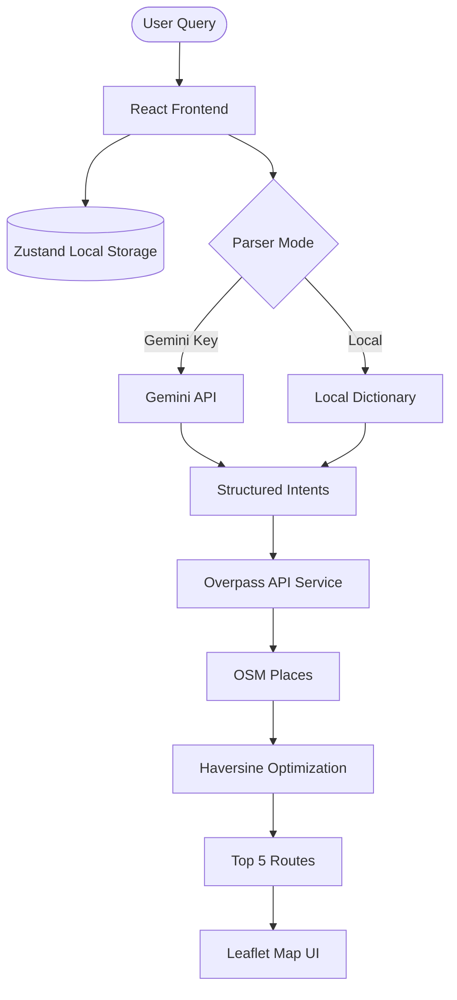

# ClusterRoute

ClusterRoute is a premium, fully client-side web application that helps users find the optimal route through a cluster of nearby places. It uses OpenStreetMap (Overpass API) to fetch locations and offers dual-mode query parsing (Gemini Flash Lite or a robust local dictionary parser).

## Deliverables Status
- ✅ Complete application
- ✅ GitHub Actions workflow (`.github/workflows/deploy.yml`)
- ✅ Environment documentation (Below)
- ✅ Deployment instructions (Below)
- ✅ Architecture diagram (Below)
- ✅ Sample Screenshots section (Below)

## Architecture Diagram



## Environment Documentation
All environment configuration is managed strictly client-side via `localStorage`. No `.env` files are required for deployment.
If you use the Gemini AI parser, input your API key on the `Settings` page. It will be stored securely in your browser's local storage.

## Deployment Instructions (GitHub Pages)
1. Push this repository to GitHub (e.g., to a repository named `ClusterRoute`).
2. Go to **Settings > Pages**.
3. Change the **Source** to **GitHub Actions**.
4. The included workflow (`.github/workflows/deploy.yml`) will automatically trigger on pushes to the `main` branch.
5. Once deployed, the app uses `404.html` and Vite base path mapping to securely route SPA paths on GitHub Pages.

## Sample Screenshots
*Add your images here:*
- `Home Route:` 
- `Settings View:` 

## Tech Stack
- React 19, TypeScript, Vite
- Tailwind CSS v4, shadcn/ui
- Zustand, TanStack Query, React Router v6+
- Leaflet, React-Leaflet, i18next (ar, en, fr)

## Local Development
```bash
npm install
npm run dev
```
